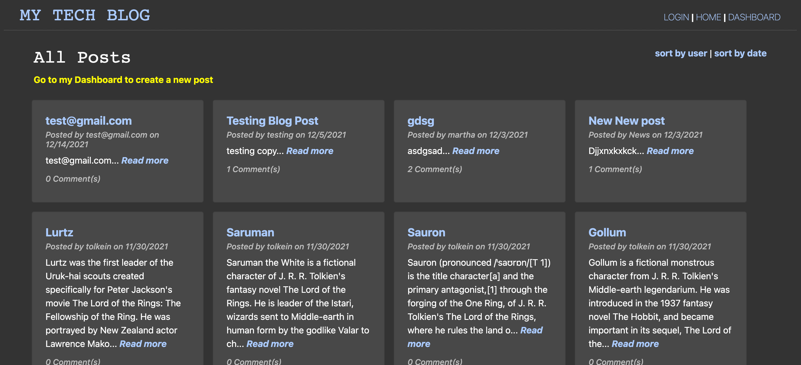

  
  # MVC Challenge Tech Blog 
  
  

  ## Table of Contents
  * [ Description ](#about)
  * [ Installation ](#installation)
  * [ Usage ](#usage)
  * [ License ](#license)
  * [ Questions ](#questions)

  
  ## Description
  This is a CMS-style blog site you can use to create your own blog where users can log in and create their own blogs and comment on other users' blogs. This app was developed using the following: Node.js, Express, Sequelize, and Handlebars, amongst a few others.

  
  ## Installation
  run `git clone https://github.com/cshepscorp/MVC-Challenge-Tech-Blog.git` to clone onto your machine\
  run `npm install` to install the appropriate packages for this application.\
  You will need access to a mysql database in order to run this package. Don't forget to update credentials in the config/connection.js file with your own.\
  Once downloaded and successfully installed, feel free to use to create your own blog.

  
  ## Usage
  `source db/schema.sql` to create database from mysql command\
  `use <database-name>;` switch to your newly created database\
  `node db/seedPosts.js` in command line to populate your database with data\
  `npm start` to run your server 

  Use Heroku and the JAWSDB add-on to deploy your blog so users can interact with it. In order to use sessions, update the SS variable in the `server.js` file

  
  ## License
  MIT - A short and simple permissive license with conditions only requiring preservation of copyright and license notices. Licensed works, modifications, and larger works may be distributed under different terms and without source code. ([Read more about the MIT license](https://choosealicense.com/licenses/mit/))

  
  ## Questions
  Feel free to reach out to me with any additional questions
  * [Find me on GitHub](https://github.com/cshepscorp/)
  * Email me at: sheppard.christy@gmail.com
